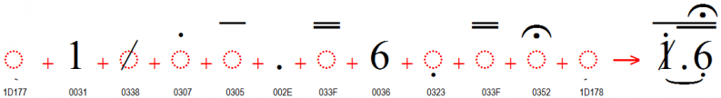
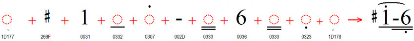

## About

The Cipher music notation is used throughout Indonesia and China for all kinds of music. The font is not intended for general orthographic use, although it is usable for song lyrics in simple Roman writing systems. This solution is primarily intended for fairly straightforward songbooks for singers, not for complex instrumental music. It can handle harmony lines fine, but not a lot of intricacies or subtleties (e.g. no staccato).

If you use this font for developing songbooks and you have suggestions for improvements we would like to hear back from you. Contact information is below.

### Cipher Music Notation Requirements

The main requirements for this font were originally to support the Indonesian Cipher Music Notation (Kepatihan). However, where it was straightforward to add support for the Chinese jianpu style, we have done so.

Characters | USV | Meaning
:-- | :- | :-------
**Musical note**||
1-7|U+0031..U+0037|musical notes (do re mi fa so la ti)
**Octaves**||
◌̣|U+0323 COMBINING DOT BELOW|down one octave (Chinese jianpu: goes below any underlines) _turunkan satu oktaf (Cina: taruh di bawah garis bawah jika ada)_
◌̇|U+0307 COMBINING DOT ABOVE|up one octave (Indonesian kepatihan: goes below any overlines) _naikkan satu oktaf; ditaruh di bawah garis atas jika ada_
**Note length**||
.|U+002E FULL STOP|Indonesian kepatihan: extend duration of the preceding note by an entire quarter note (becomes a half note) _Kepatihan: perpanjang waktu not yang sebelumnya._
-|U+002D HYPHEN-MINUS or U+2012 FIGURE DASH |Chinese jianpu: extend duration of the preceding note by an entire quarter note (becomes a half note) _Cina: perpanjang waktu not yang sebelumnya._
·|U+00B7 MIDDLE DOT|Chinese jianpu: extend duration of the preceding note by half, two dots extends duration by three quarters
◌̅|U+0305 COMBINING OVERLINE|Indonesian kepatihan: eighth note _not (nada) kedelapan_
◌̿|U+033F COMBINING DOUBLE OVERLINE|Indonesian kepatihan: sixteenth note _not (nada) keenam belas_
◌̲|U+0332 COMBINING LOW LINE|Chinese jianpu: eighth note _Cina: not (nada) kedelapan_
◌̳|U+0333 COMBINING DOUBLE LOW LINE|Chinese jianpu: sixteenth note _Cina: not (nada) keenam belas_
**Musical rest**||
0|U+0030 DIGIT ZERO|musical rest (i.e. don't sing or play) _istirahat (diam); jangan menyanyi atau mainkan)_
**Bar lines**||
𝄀|U+1D100 MUSICAL SYMBOL SINGLE BARLINE|measure boundary _batas birama_
𝄁|U+1D101 MUSICAL SYMBOL DOUBLE BARLINE|end of a section of music _akhir dari suatu bagian musik_
𝄂|U+1D102 MUSICAL SYMBOL FINAL BARLINE|very end of a piece of music
𝄃|U+1D103 MUSICAL SYMBOL REVERSE FINAL BARLINE|unsure of usage
𝄆|U+1D106 MUSICAL SYMBOL LEFT REPEAT SIGN|this section will be repeated _bagian ini akan diulangi_
𝄇|U+1D107 MUSICAL SYMBOL RIGHT REPEAT SIGN|go back to the left repeat sign _kembali ke tanda ulang kiri_
𝄈|U+1D108 MUSICAL SYMBOL REPEAT DOTS|a simpler repeat sign; sometimes used in conjunction with U+1D100
**Accidentals**||
/|U+0338 COMBINING LONG SOLIDUS OVERLAY|Indonesian kepatihan: sharp (used on numbers 1-6) _1-6: tinggikan (naikkan) nada 1/2 laras_
&#x20E5;|U+20E5 COMBINING REVERSE SOLIDUS OVERLAY|Indonesian kepatihan: sharp (used on number 7) _7: tinggikan (naikkan) nada 1/2 laras_
♭|U+266D MUSIC FLAT SIGN<|Chinese jianpu: flat _Cina: turunkan nada 1/2 laras (mol)_
♯|U+266F MUSIC SHARP SIGN|Chinese jianpu: sharp _Cina: tinggikan (naikkan) nada 1/2 laras_
♮|U+266E MUSIC NATURAL SIGN|Chinese jianpu: restore to natural (not sharp/flat) _Cina: kembali ke biasa_
&#x1D177;  &#x1D178;|U+1D177 MUSICAL SYMBOL BEGIN SLUR U+1D178 MUSICAL SYMBOL END SLUR|In music, this is a slur or a tie (multiple notes are run together smoothly). In lyrics, a slur contracts multiple syllables into one (multiple vowels become one diphthong). _Tanda legato. Dalam musik, satu suku kata memberi jarak semua not (nada). Dalam lirik, ini berarti "vocal rangkap" Huruf-huruf hidup berdekatan diucapkan sebagai satu suku kata."_
**Expression marks**||
◌͒|U+0352 COMBINING FERMATA|"hold", or "grand pause" _"tahan", atau "istirahat untuk seluruh pemusik"_
𝄒|U+1D112 MUSICAL SYMBOL BREATH MARK|singers, breathe now _para penyanyi tarik nafas_
**Glissandi**||
&#x1D1B1;|U+1D1B1 MUSICAL SYMBOL GLISSANDO UP|The glissandi symbols tell the singer to swoop through the notes. The angle indicates an upward swoop.
&#x1D1B2;|U+1D1B2 MUSICAL SYMBOL GLISSANDO DOWN|Swoop down through the notes.

All of the characters documented above (not including combining marks) are either of "full" width or "half" width. This allows for the font to use the proper width of the overlines or underlines. In addition, regular orthographic characters are provided for use in lyrics. Lyric characters have proportional widths. As long as you don't mix in other characters, you should therefore be able to align harmony lines with the melody line by adding spaces (which are "half" width) appropriately. Because lyric characters have proportional widths they cannot be precisely aligned unless you use tabs, but this is generally less important.

_Semua tanda yang tercantum di atas, lebarnya "lengkap" atau "setengah". Sepanjang Anda tidak mencampurkan tanda/huruf lain, maka Anda dapat memantapkan baris-baris harmonis dengan baris melodi, dengan menambahkan jarak / spasi (yang adalah "setengah" lebarnya). Huruf-huruf lirik mempunyai lebar yang proporsional dan tidak dapat dengan tepat dipaskan jika Anda tidak menggunakan tabs, namun biasanya ini kurang penting._

**NOTE:** The font cannot properly display diacritics that are "out of order". You must input the base followed by an optional centered diacritic, followed by optional below diacritic(s), followed by optional above diacritics. Beginning and ending slurs should be at the outer edge of each run of text. The example below shows the proper order of characters:

{.fullsize}
<!-- PRODUCT SITE IMAGE SRC https://software.sil.org/wp/wp-content/uploads/2022/08/Cipher_IndonesianKepatihan.png -->
<figcaption>Indonesian kepatihan</figcaption>

{.fullsize}
<!-- PRODUCT SITE IMAGE SRC https://software.sil.org/wp/wp-content/uploads/2022/08/Cipher_ChineseJianpu.png -->
<figcaption>Chinese jianpu</figcaption>

### Rendering

This font makes use of the OpenType smart font technologies. However, many Windows applications do not support combining marks on spaces, punctuation or numbers — all of which are used in Cipher Notation! In addition, Windows applications do not support the use of combining marks from the BMP in combination with base characters from the SMP (the breathing mark is in the SMP).

### Font features

This font uses the "edit" mode by default. The default mode has tiny slur tips rather than the slur. This mode allows for easier editing between the beginning and ending of the slur. When a document is ready for turning the slurs "on", A Stylistic set can be chosen for **Below (Indonesian kepatihan)** or **Above (Chinese jianpu)**. 

- **Indonesian kepatihan (Below)** (ss01=1)
- **Chinese jianpu (Above)** (ss02=1)

Slurs will display as slurs for up to 8 base characters. It might be less than that if there are many dots, fermata, and over- or under-lines. Once the slurs "fail" they default to small beginning and ending marks under the base characters.

At this time the support for the Slurs is dependent on the examples seen in use. If a slur is not working with a particular string, please report it through the Github issues. 

### Supported characters

The following character ranges are supported by this font:

Unicode block | Doulos SIL Cipher support
:------------- | :---------------
Codepage 1252 (Western) &amp; MacRoman | ✓
Combining Diacritical Marks|U+0305 U+0307 U+0323 U+0332..U+0333 U+0338 U+033F U+034F U+0352 U+03C0
Superscripts and Subscripts|U+2070 U+2074..U+2079 U+2080..U+2089
Combining Diacritical Marks for Symbols|U+20E5
Arrows|U+2197..U+2198
Miscellaneous Symbols|U+266D..U+266F
Latin Extended-D|U+A78B..U+A78C
Musical Symbols|U+1D100..U+1D103 U+1D106..U+1D108 U+1D110 U+1D112 U+1D177..U+1D178

## Downloads

### License

Theis font is licensed under the [SIL Open Font License (OFL)](https://openfontlicense.org/)

### Keyman Keyboard

The [Cipher Music (SIL)](https://keyman.com/keyboards/sil_cipher_music) Keyman keyboard is available to help you type using the Cipher music notation.

### LibreOffice Cipher Songs Template

To use this template, type your songs using the provided "song" styles. At first, it's easiest to start by copying the sample song text into a blank page, since all of the styles are set up already. Delete the instructions in this document once you don't need them anymore. You may not want to delete the "Special Symbols" part until you're ready to publish.

_Untuk memakai "template" ini, ketiklah lagu-lagu dengan memakai style-style "song" yang tersediah. Untuk pemula, cara yang paling mudah adalah: kopi lagu contoh ke halaman kosong, sebab semua style telah disetel dalam contohnya. Silahkan hapus petunjuk-petunjuk seperti ini kalau tidak diperlukan lagi._

Cipher template changes:

- Changed the page size to 12.5cm x 17.5cm (but in inches: 4.92" x 6.89"), with 0.5" margins all around
- TOC settings: added a space before each song title.
- Formatted numbering for song titles to use a space rather than a tab. This helps with longer song numbers.
- "song lyrics only": switched away from fixed height (back to "single") since slurs were getting cut off. Added more slurs to the initial example for better awareness in the future.
- "song verse lyrics", "song verse lyrics indented": added 0.08" line spacing after each paragraph, so notes will seem closer to their own lyrics.
- Added a tip: "Or, you can edit the song title style to toggle page breaks before songs for the whole file."
- Renamed "song verse indented" to "song verse notes indented", for consistency.
- Enabled "Keep with next paragraph" for these styles (the two lyrics styles inherited that, so I then turned it off for them):
    - song title
    - song info
    - song verse notes
    - song verse notes indented

## Future plans

This font is actively maintained and improved, and recent changes to the development process will enable more frequent releases.

The highest priorities for future additions and enhancements are mainly driven by:

- New additions to [The Unicode Standard](https://unicode.org/)
- Requests from language communities using the fonts
- Needs of the linguistic and academic community

## Announcement list

If you wish to receive announcements about updates to any of our SIL fonts, please subscribe to our [SIL Font News Announcement List](https://groups.google.com/a/groups.sil.org/forum/#!forum/sil-font-news). This is an announcement-only list with messages approximately once a month. It does not allow any discussion.

You can subscribe using either of the two following options.

- If you use a Google profile and join the group, you will be able to access the group and control your subscription and notification options with a web browser. Make sure you are logged in to your Google profile and go to the [SIL Font News Google Group](https://groups.google.com/a/groups.sil.org/forum/#!forum/sil-font-news). Click on **Join group**.

- If you would rather not use a Google profile, you can subscribe any email address by sending a message to [sil-font-news+subscribe@groups.sil.org](mailto:sil-font-news+subscribe@groups.sil.org) and following the instructions you get in the confirmation message.

## Supporting the project

These fonts are provided at no cost; however, they are expensive to produce and maintain. Please consider donating to SIL’s font development efforts to support future development. Go to the [WSTech donation page](https://give.sil.org/campaign/725115/donate). **Thank you!** 

Before requesting technical support, please **carefully read all the documentation included with the fonts and linked pages on the web site**. The [Font Help pages](https://software.sil.org/fonts/guides/) are a good place to begin.

## About SIL Global

[SIL Global](https://www.sil.org/) is a global, faith-based nonprofit that works with local communities around the world to develop language solutions that expand possibilities for a better life. 

As of 2024, we are involved in approximately 1,530 active language projects in 107 countries. These projects impact more than 950+ million people. SIL’s work brings together more than 4,373 staff from 86 countries who work alongside thousands more local partners and community volunteers worldwide. Our services are available without regard to religious belief, political ideology, gender, race or ethnic background.

Our Vision: We long to see people flourishing in community using the languages they value most. 

Our Mission: Inspired by God’s love, we advocate, build capacity, and work with local communities to apply language expertise that advances meaningful development, education, and engagement with Scripture.

[SIL Language Technology](https://software.sil.org/) supports these activities by developing [software](https://software.sil.org/software-products/), [fonts](https://software.sil.org/fonts/), and [keyboard technologies](https://keyman.com/).

## Language Software Community

For person-to-person support visit the [SIL Language Software Community](https://community.software.sil.org/c/silfonts), where font developers and users can help each other. These support discussions can also help others in the future.

## Reporting bugs and feature requests

If you have a bug to report or a suggestion for how we could improve the fonts please create an issue in the [Github Doulos SIL Cipher project](https://github.com/silnrsi/font-doulos-sil-cipher/issues) or contact us directly.

## Contact form

For support, or for more information, please visit the Doulos SIL Cipher page on SIL Global's
Computers and Writing systems website:
https://software.sil.org/doulos-sil-cipher/

<!-- PRODUCT SITE ONLY
[font id='cipher' face='DoulosSILCipher-Regular' size='150%']
-->
